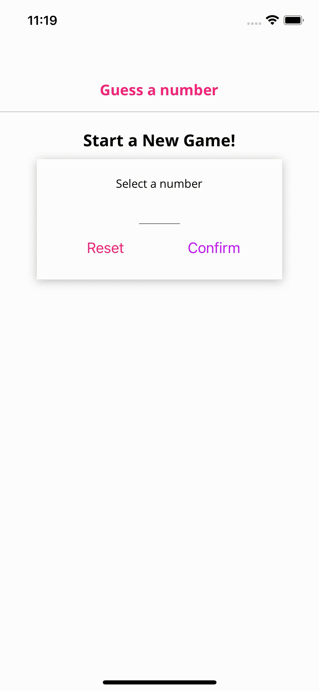
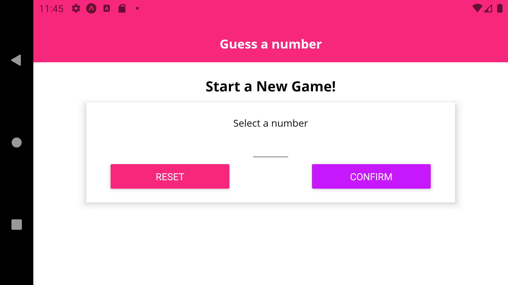
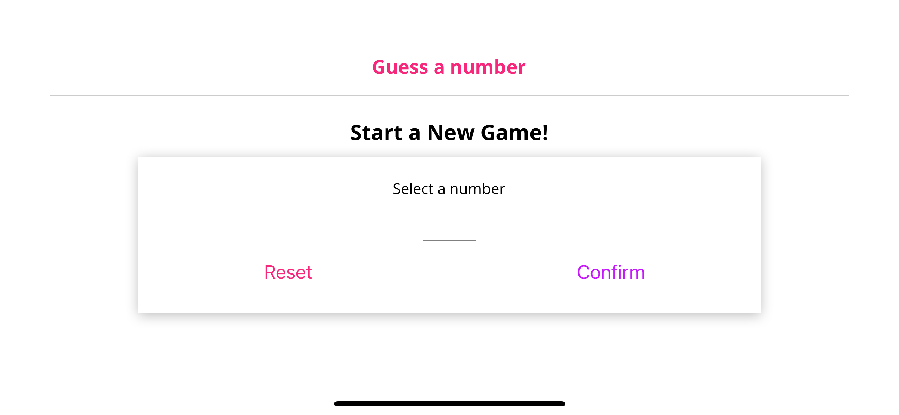

# Guess A Number App
## An Simple app to play a number guessing game with phone
```diff
# Sample Game Play (Android & iOS)
```
<p align="center">


</p>

```diff
# Sample Landscape Mode (Android & iOS)
```
<p align="center">


</p>

## Steps to play the app
1. Input a number for phone to guess.
2. Click "Confirm" button to confirm the input number or click "Reset" button to reset the number choosen.
3. Click "Start Game" button to start the game.
4. Compare to the number displayed/guess by the phone, select "Minus" button for lower number and "Plus" button for greater number. 
5. Continue giving hint to phone until it guess the correct number of your choise.
6. The Game Over screen will be displayed with a summary text of the game.
7. Click "New Game" button to play again!!!

## Sample Implementation
- Adding Custom Header Component
- Adding Screen Component
- Styling a View as a Card Container (With Drop Shawdows & Rounded Corners)
- Extracting a Card Component (Presentational Component)
- Color Theming with Constants
- Configuring & Styling a TextInput
- Cleaning User Input & Controlling the Soft Keyboard
- Resetting & Confirming User Input
- Showing an Alert
- Showing confirmation box
- Adding Random Number Generation
- Switching Between Multiple Screens
- Adding Game Features: Hints & Validation
- Checking the "Win" Condition with useEffect()
- Complete Game Logic
- Adding AppLoading
- Adding Custom Fonts
- Installing expo-font
- Adding Local Images
- Working with Network (Web) Images
- Building a Custom Button Component
- Adding Icons
- Managing Past Guesses as a List
- Styling List Items & List
- FlatList & Flexbox
- More Flexible Styling Rules
- Dimenstion API
- Calculate Sizes Dynamically
- Controlling Orientation & Using the KeyboardAvoidingView
- Listenign to Orientation Changes
- Rendering Different Layouts
- Fixing the GameOver Screen
- Platform API
- Using the SafeAreaView